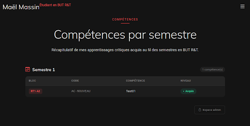

# Portfolio de Maël - SAE23 R&T

Ce projet est un portfolio dynamique géré avec Flask et MariaDB, entièrement conteneurisé avec Docker.

##  Aperçu du rendu final
Voici à quoi ressemble l'interface une fois le projet lancé :


## 🛠️ Installation et Lancement
1. S'assurer que Docker et Docker Compose sont installés.
2. Lancer la commande :
   ```bash
   sudo docker-compose up --build
